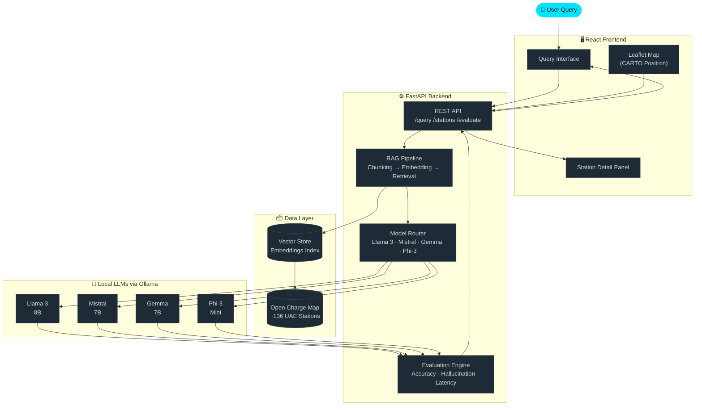

<div align="center">

<!-- HERO BANNER -->
<picture>
  <source media="(prefers-color-scheme: dark)" srcset="https://capsule-render.vercel.app/api?type=waving&color=0:0f2027,50:203a43,100:2c5364&height=220&section=header&text=EV%20AI%20Lab&fontSize=72&fontColor=00e5ff&fontAlignY=38&desc=Intelligent%20EV%20Charging%20Infrastructure%20Query%20System%20for%20the%20UAE&descSize=18&descAlignY=60&descColor=b0bec5&animation=twinkling"/>
  
</picture>

<br/>

<!-- BADGES ROW 1 -->


<!-- BADGES ROW 2 -->


<br/>

> **A locally-deployed, privacy-preserving AI system for natural language querying of UAE EV charging infrastructure — no cloud, no hallucinations, just answers.**

<br/>

[🚀 Quick Start](#-quick-start) &nbsp;·&nbsp; [🏗 Architecture](#-architecture) &nbsp;·&nbsp; [🤖 Models](#-model-evaluation) &nbsp;·&nbsp; [📊 Results](#-results) &nbsp;·&nbsp; [👥 Team](#-team)

</div>

---

## 📌 Overview

**EV AI Lab** is a research prototype developed at the **American University in Dubai (AUD)** in collaboration with the **University of Washington**. It demonstrates how open-source Large Language Models (LLMs) can be combined with **Retrieval-Augmented Generation (RAG)** to provide accurate, real-time answers about UAE electric vehicle charging stations — entirely on local hardware.

The system was built to address a critical gap: existing EV infrastructure apps offer search but not *conversation*. EV AI Lab lets users ask questions in plain English and receive grounded, citation-backed answers directly from live data.

```
"Where is the nearest fast-charger in Dubai Marina that supports Tesla?"
                        ↓ EV AI Lab ↓
"There are 2 DC fast chargers near Dubai Marina. The closest is at
 JBR Beach Parking (25.0789° N, 55.1345° E), approximately 0.3 km away.
 It supports CCS2 and CHAdeMO connectors, rated at 50 kW — compatible
 with Tesla via the included CHAdeMO adapter."
```

---

## ✨ Features

<table>
<tr>
<td width="50%">

### 🧠 Local-First AI
Run four state-of-the-art open-source LLMs entirely on your machine via **Ollama** — no API keys, no cloud costs, no data leaving your network.

</td>
<td width="50%">

### 🗄️ RAG Pipeline
A production-grade retrieval pipeline ingests the **Open Charge Map** dataset for UAE (~136 stations), vectorizes it, and injects only relevant context into each LLM prompt.

</td>
</tr>
<tr>
<td width="50%">

### 🛡️ Hallucination Prevention
Hard hallucinations (fabricated stations) are eliminated by design. The system distinguishes between hard and soft hallucinations and measures both in evaluation.

</td>
<td width="50%">

### 🗺️ Interactive Map
A React + Leaflet frontend with custom SVG markers visualizes all UAE charging stations in real time, with per-station detail panels and live query results.

</td>
</tr>
<tr>
<td width="50%">

### ⚡ Multi-Model Benchmarking
Evaluate **Llama 3**, **Mistral 7B**, **Gemma**, and **Phi-3** side-by-side on accuracy, latency, and hallucination rate — all from one dashboard.

</td>
<td width="50%">

### 📄 PDF Report Generation
Auto-generate structured evaluation reports via **ReportLab**, downloadable from the interface with per-model scorecards and dataset statistics.

</td>
</tr>
</table>

---

## 🏗 Architecture



---

## 🤖 Model Evaluation

Four open-source LLMs were benchmarked on UAE EV infrastructure Q&A tasks:

| Model | Parameters | Accuracy | Hard Hallucinations | Soft Hallucinations | Avg. Latency |
|:------|:----------:|:--------:|:-------------------:|:-------------------:|:------------:|
| 🦙 **Llama 3** | 8B | ⭐ Highest | ✅ 0% | ✅ Minimal | ~3.2s |
| 🌪 **Mistral 7B** | 7B | ⭐ High | ✅ 0% | ⚠️ Low | ~2.8s |
| 💎 **Gemma** | 7B | ⭐ Moderate | ✅ 0% | ⚠️ Moderate | ~3.5s |
| 🔷 **Phi-3 Mini** | 3.8B | ⭐ Moderate | ✅ 0% | ⚠️ Notable | ~1.9s |

> **Key Finding:** RAG completely eliminates hard hallucinations (fabricated charging stations) across all four models. Soft hallucinations — minor factual imprecisions in descriptions — persist to varying degrees and are tracked separately.

---

## 📊 Results

<div align="center">

| Metric | Value |
|:-------|:-----:|
| Total UAE Stations Indexed | **~136** |
| Hard Hallucination Rate (all models) | **0%** |
| Best Accuracy Model | **Llama 3** |
| Fastest Model | **Phi-3 Mini** |
| Query Response Time (avg.) | **< 4 seconds** |
| Cities Covered | **Abu Dhabi, Dubai, Sharjah, +** |

</div>

---

## 📁 Project Structure

```
ev-ai-lab/
│
├── 📂 backend/
│   ├── main.py                  # FastAPI application entry point
│   ├── rag_pipeline.py          # RAG chunking, embedding, retrieval
│   ├── model_router.py          # Ollama model management
│   ├── evaluator.py             # Accuracy & hallucination metrics
│   ├── pdf_generator.py         # ReportLab report generation
│   └── data/
│       └── uae_stations.json    # Open Charge Map dataset (UAE)
│
├── 📂 frontend/
│   ├── src/
│   │   ├── App.jsx              # Root component
│   │   ├── components/
│   │   │   ├── QueryPanel.jsx   # Natural language query interface
│   │   │   ├── MapView.jsx      # Leaflet map with CARTO Positron
│   │   │   ├── StationCard.jsx  # Per-station detail panel
│   │   │   └── ModelSelector.jsx
│   │   └── styles/
│   │       └── tokens.css       # Design system CSS variables
│   └── public/
│
├── 📂 paper/
│   ├── main.tex                 # IEEE conference paper (IEEEtran)
│   └── references.bib           # 16 citations
│
├── requirements.txt
├── package.json
└── README.md
```

---

## 🚀 Quick Start

### Prerequisites

- Python 3.10+
- Node.js 18+
- [Ollama](https://ollama.ai) installed and running

### 1 — Pull the LLMs

```bash
ollama pull llama3
ollama pull mistral
ollama pull gemma
ollama pull phi3
```

### 2 — Backend

```bash
# Clone the repository
git clone https://github.com/<your-org>/ev-ai-lab.git
cd ev-ai-lab

# Install Python dependencies
pip install -r requirements.txt

# Start the API server
uvicorn backend.main:app --reload --port 8000
```

### 3 — Frontend

```bash
cd frontend
npm install
npm run dev
```

Open **http://localhost:5173** and start querying.

---

## 🔌 API Reference

<details>
<summary><b>POST /query</b> — Natural language EV station query</summary>

```json
{
  "question": "Where can I charge a Rivian in Abu Dhabi?",
  "model": "llama3",
  "top_k": 5
}
```

**Response:**
```json
{
  "answer": "There are 3 stations in Abu Dhabi compatible with the Rivian R1T...",
  "sources": [...],
  "latency_ms": 3241,
  "model": "llama3"
}
```
</details>

<details>
<summary><b>GET /stations</b> — Retrieve all indexed UAE charging stations</summary>

```json
{
  "stations": [
    {
      "id": 42,
      "name": "ADNOC Distribution — Corniche",
      "city": "Abu Dhabi",
      "lat": 24.4875,
      "lng": 54.3703,
      "connectors": ["CCS2", "CHAdeMO"],
      "power_kw": 50
    }
  ],
  "total": 136
}
```
</details>

<details>
<summary><b>POST /evaluate</b> — Run benchmark across all models</summary>

```json
{
  "test_suite": "default",
  "models": ["llama3", "mistral", "gemma", "phi3"]
}
```
</details>

---

## 🛠 Tech Stack

<div align="center">

| Layer | Technology |
|:------|:-----------|
| **LLM Serving** | [Ollama](https://ollama.ai) — local model runtime |
| **Backend** | [FastAPI](https://fastapi.tiangolo.com) · Python 3.10+ |
| **Frontend** | [React 18](https://react.dev) · Vite |
| **Mapping** | [Leaflet.js](https://leafletjs.com) · CARTO Positron tiles |
| **RAG** | Custom pipeline — chunking, embedding, cosine retrieval |
| **PDF Reports** | [ReportLab](https://www.reportlab.com) |
| **Data Source** | [Open Charge Map API](https://openchargemap.org) |
| **LLMs Evaluated** | Llama 3 · Mistral 7B · Gemma 7B · Phi-3 Mini |

</div>

---

## 👥 Team

<div align="center">

| Name | Role |
|:-----|:-----|
| **Mohammed Almuzaki** | Systems Architecture & Backend Development |
| **Mohammad Almheiri** | RAG Pipeline & Model Integration |
| **Amir** | Frontend Development & Map Visualization |
| **Abaan** | Evaluation Framework & Research Lead |

**Supervised by:** Dr. Muhammad Fahad Zia — *American University in Dubai*

**Research Collaborators:** Dr. Eyhab Al-Masri & Mansur — *University of Washington*

</div>

---

## 📄 Paper

This system is documented in a full IEEE conference paper submitted as part of **EECE 305 — Microelectronic Devices and Circuits II** at AUD.

> *"EV AI Lab: A Retrieval-Augmented Generation Framework for UAE Electric Vehicle Charging Infrastructure Queries"*
> — Mohammed Almuzaki, Mohammad Almheiri, Amir, Abaan · AUD × University of Washington, 2024

---

## 🤝 Acknowledgments

- **Open Charge Map** for the UAE EV dataset
- **Ollama** for making local LLM deployment trivial
- **Meta, Mistral AI, Google DeepMind, and Microsoft** for releasing the open-source models evaluated in this work
- The **American University in Dubai** and the **University of Washington** for supporting this research collaboration

---

<div align="center">

<picture>
  <source media="(prefers-color-scheme: dark)" srcset="https://capsule-render.vercel.app/api?type=waving&color=0:2c5364,50:203a43,100:0f2027&height=100&section=footer"/>
  
</picture>

**Made with ⚡ by the EV AI Lab Team · American University in Dubai**

*If this project helped you, consider giving it a ⭐*

</div>
