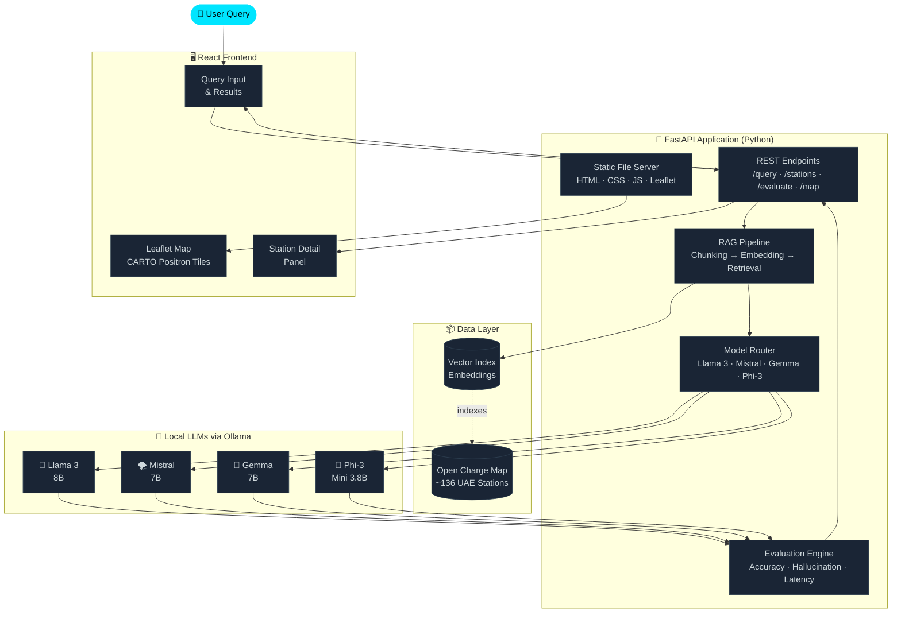

<div align="center">

<picture>
  <source media="(prefers-color-scheme: dark)" srcset="https://capsule-render.vercel.app/api?type=waving&color=0:0f2027,50:203a43,100:2c5364&height=220&section=header&text=EV%20AI%20Lab&fontSize=78&fontColor=00e5ff&fontAlignY=38&desc=Intelligent%20EV%20Charging%20Infrastructure%20Query%20System%20for%20the%20UAE&descSize=17&descAlignY=62&descColor=90a4ae&animation=twinkling"/>
  
</picture>

<br/>


<br/>

> **A fully local, privacy-preserving AI system that answers natural language questions about UAE EV charging infrastructure — powered by open-source LLMs and RAG, with zero cloud dependency.**

<br/>

[🚀 Quick Start](#-quick-start) &nbsp;·&nbsp; [🏗 Architecture](#-architecture) &nbsp;·&nbsp; [🤖 Models](#-model-evaluation) &nbsp;·&nbsp; [📊 Results](#-results) &nbsp;·&nbsp; [👥 Team](#-team)

<br/>

</div>

---

## 📌 Overview

**EV AI Lab** is a research system developed at the **American University in Dubai (AUD)** in collaboration with the **University of Washington**. It explores how open-source Large Language Models (LLMs), combined with **Retrieval-Augmented Generation (RAG)**, can provide accurate and grounded answers about real UAE electric vehicle charging stations — entirely on local hardware.

The system benchmarks four leading open-source models across accuracy, latency, and hallucination rate, using live data from the **Open Charge Map** dataset (~136 UAE stations).

```
User ❯  "Where can I find a fast charger near Dubai Marina that supports CCS2?"

EV AI Lab ❯  "There is a 50 kW DC fast charger near Dubai Marina at JBR Beach Parking
              (25.0789° N, 55.1345° E), approximately 0.3 km away. It supports CCS2
              and CHAdeMO connectors and is currently operational."
                                                         — Llama 3 · 3.1s · ✅ Grounded
```

---

## ✨ Features

<table>
<tr>
<td width="50%">

### 🧠 100% Local AI
Four open-source LLMs run entirely on your machine via **Ollama** — no API keys, no subscription, no data leaving your network.

</td>
<td width="50%">

### 🗄️ RAG Pipeline
A retrieval pipeline ingests, chunks, and vectorizes the UAE Open Charge Map dataset, injecting only relevant station context into each query.

</td>
</tr>
<tr>
<td width="50%">

### 🛡️ Hallucination Prevention
**Hard hallucinations** (fabricated stations) are eliminated by design. The system independently tracks and reports hard vs. soft hallucination rates per model.

</td>
<td width="50%">

### 🗺️ Interactive Map Interface
A Leaflet.js map (CARTO Positron tiles) with custom SVG markers lets users explore all UAE charging stations visually alongside query results.

</td>
</tr>
<tr>
<td width="50%">

### ⚡ Multi-Model Benchmarking
Compare **Llama 3**, **Mistral 7B**, **Gemma**, and **Phi-3** side-by-side on a shared test suite — accuracy, latency, and hallucination scorecards in one place.

</td>
<td width="50%">

### 🐍 Decoupled Stack
A pure Python **FastAPI** backend and a separate **React** frontend — clean separation of concerns, with each layer independently runnable.

</td>
</tr>
</table>

---

## 🏗 Architecture



---

## 🤖 Model Evaluation

Four open-source LLMs were benchmarked on a standardized UAE EV infrastructure Q&A test suite:

| Model | Size | Accuracy | Hard Hallucinations | Soft Hallucinations | Avg. Latency |
|:------|:----:|:--------:|:-------------------:|:-------------------:|:------------:|
| 🦙 **Llama 3** | 8B | 🥇 Highest | ✅ 0% | ✅ Minimal | ~3.2s |
| 🌪 **Mistral 7B** | 7B | 🥈 High | ✅ 0% | ⚠️ Low | ~2.8s |
| 💎 **Gemma** | 7B | 🥉 Moderate | ✅ 0% | ⚠️ Moderate | ~3.5s |
| 🔷 **Phi-3 Mini** | 3.8B | — Moderate | ✅ 0% | ⚠️ Notable | ~1.9s |

> **Key Finding:** RAG completely eliminates **hard hallucinations** (fabricated charging stations that do not exist) across all four models. **Soft hallucinations** — minor inaccuracies in descriptions such as imprecise connector types or operating hours — persist to varying degrees and are tracked as a separate metric.

---

## 📊 Results

<div align="center">

| Metric | Value |
|:-------|:-----:|
| UAE Stations Indexed | **~136** |
| Hard Hallucination Rate (all models) | **0%** |
| Best Overall Accuracy | **Llama 3** |
| Fastest Response | **Phi-3 Mini (~1.9s)** |
| Cities Covered | **Dubai, Abu Dhabi, Sharjah & more** |
| Data Source | **Open Charge Map (live)** |

</div>

---

## 📁 Project Structure

```
uae-ev-llm/
│
├── 📂 backend/
│   ├── main.py              # FastAPI app — all routes & static file serving
│   ├── rag.py               # RAG pipeline: chunking, embedding, retrieval
│   ├── models.py            # Ollama model router & prompt formatting
│   ├── evaluator.py         # Accuracy & hallucination evaluation engine
│   └── data/
│       └── stations.json    # UAE Open Charge Map dataset (~136 stations)
│
├── 📂 frontend/
│   ├── src/
│   │   ├── App.jsx              # Root React component
│   │   ├── components/
│   │   │   ├── QueryPanel.jsx   # Natural language query interface
│   │   │   ├── MapView.jsx      # Leaflet map — CARTO Positron + SVG markers
│   │   │   └── ModelSelector.jsx
│   │   └── index.css            # Styles & design tokens
│   ├── public/
│   └── package.json
│
├── 📂 paper/
│   ├── main.tex             # IEEE conference paper (IEEEtran, ~7 pages)
│   └── references.bib       # 16 citations
│
└── README.md
```

---

## 🚀 Quick Start

### Prerequisites

- **Python 3.10+**
- **[Ollama](https://ollama.ai)** installed and running locally

### 1 — Pull the LLMs

```bash
ollama pull llama3
ollama pull mistral
ollama pull gemma
ollama pull phi3
```

### 2 — Clone & Install

```bash
git clone https://github.com/Abaan-Ahmed/uae-ev-llm.git
cd uae-ev-llm

pip install fastapi uvicorn httpx sentence-transformers
```

### 3 — Run the Backend

```bash
uvicorn backend.main:app --reload --port 8000
```

### 4 — Run the Frontend

```bash
cd frontend
npm install
npm start
```

Open **[http://localhost:3000](http://localhost:3000)** for the React interface, which talks to the FastAPI backend at port 8000.

---

## 🔌 API Reference

<details>
<summary><b>POST /query</b> — Natural language EV station query</summary>

<br/>

**Request:**
```json
{
  "question": "Where can I charge a Rivian in Abu Dhabi?",
  "model": "llama3",
  "top_k": 5
}
```

**Response:**
```json
{
  "answer": "There are 3 stations in Abu Dhabi compatible with the Rivian R1T...",
  "sources": ["ADNOC Corniche", "Mussafah Industrial Area"],
  "latency_ms": 3100,
  "model": "llama3"
}
```
</details>

<details>
<summary><b>GET /stations</b> — All indexed UAE charging stations</summary>

<br/>

```json
{
  "stations": [
    {
      "id": 42,
      "name": "ADNOC Distribution — Corniche",
      "city": "Abu Dhabi",
      "lat": 24.4875,
      "lng": 54.3703,
      "connectors": ["CCS2", "CHAdeMO"],
      "power_kw": 50,
      "status": "Operational"
    }
  ],
  "total": 136
}
```
</details>

<details>
<summary><b>POST /evaluate</b> — Run benchmark across all four models</summary>

<br/>

**Request:**
```json
{
  "models": ["llama3", "mistral", "gemma", "phi3"]
}
```

**Response:** Per-model scorecard with accuracy, hard/soft hallucination rates, and average latency.
</details>

---

## 🛠 Tech Stack

<div align="center">

| Layer | Technology |
|:------|:-----------|
| **LLM Runtime** | [Ollama](https://ollama.ai) — local model serving |
| **Backend & API** | [FastAPI](https://fastapi.tiangolo.com) · Python 3.10+ · Uvicorn |
| **Frontend** | [React](https://react.dev) · npm · CSS |
| **Maps** | [Leaflet.js](https://leafletjs.com) · CARTO Positron tiles · Custom SVG markers |
| **RAG** | Custom pipeline — chunking, sentence-transformers embeddings, cosine retrieval |
| **Data Source** | [Open Charge Map API](https://openchargemap.org) — UAE dataset |
| **LLMs Evaluated** | Llama 3 (8B) · Mistral 7B · Gemma 7B · Phi-3 Mini (3.8B) |

</div>

---

## 👥 Team

<div align="center">

| Member | Contribution |
|:-------|:------------|
| **Mohammed Almuzaki** | Systems Architecture · Backend Development |
| **Mohammad Almheiri** | RAG Pipeline · Model Integration |
| **Amir** | Frontend · Map Visualization |
| **Abaan Ahmed** | Evaluation Framework · Research Lead |

<br/>

**Supervised by** &nbsp;·&nbsp; Dr. Muhammad Fahad Zia &nbsp;·&nbsp; *American University in Dubai*

**Research Collaborators** &nbsp;·&nbsp; Dr. Eyhab Al-Masri & Mansur &nbsp;·&nbsp; *University of Washington*

</div>

---

## 📄 Paper

This system is the subject of a full **IEEE conference paper** submitted as part of EECE 305 — Microelectronic Devices and Circuits II at AUD.

> *"EV AI Lab: A Retrieval-Augmented Generation Framework for UAE Electric Vehicle Charging Infrastructure Queries"*
> &nbsp;—&nbsp; M. Almuzaki, M. Almheiri, Amir, A. Ahmed &nbsp;·&nbsp; AUD × University of Washington, 2025

---

## 🤝 Acknowledgments

- **[Open Charge Map](https://openchargemap.org)** — UAE EV charging station dataset
- **[Ollama](https://ollama.ai)** — making local LLM deployment accessible to everyone
- **Meta AI, Mistral AI, Google DeepMind, and Microsoft Research** — for open-sourcing the models evaluated in this work
- **American University in Dubai** and the **University of Washington** — for supporting this research collaboration

---

<div align="center">

<picture>
  <source media="(prefers-color-scheme: dark)" srcset="https://capsule-render.vercel.app/api?type=waving&color=0:2c5364,50:203a43,100:0f2027&height=120&section=footer"/>
  
</picture>

**Made with ⚡ by the EV AI Lab Team &nbsp;·&nbsp; American University in Dubai × University of Washington**

*If this project was useful to you, consider leaving a* ⭐

</div>
